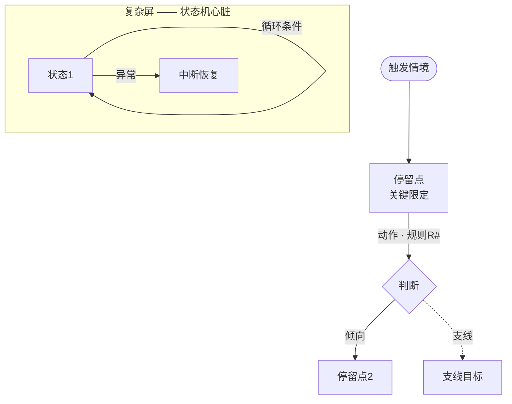

# 阶段 2：流程草图（任务卡）

## 目的

画**用户怎么流动**，不画页面长什么样。刻意粗糙、可丢弃——流程只回答：入口→步骤→判断→出口，用户在哪里停留、在哪里做决定。

## 输入

`01-需求消化.md`（设计前提 + job stories）。

## 产出与模板（写入 `02-流程草图.md`，**Mermaid**，不用 ASCII）

约定：`[ ]`=停留点（候选屏幕）｜`{ }`=判断分支｜业务规则（R#）挂边上｜虚线=支线｜**subgraph=复杂屏的内部状态机**。

结构要求：

1. **3–5 条核心任务流**（动词+宾语命名，如 `P1-提交报销单`），主流程一条是"产品脊柱"（后续关键屏从它提名）；
2. 变体与支线**不独立成流**（"老师演示"=主流程的参数变体；导出=支线），明确标注；
3. 每条流程：触发 / 步骤 / 判断 / 异常分支 / 出口，规则号挂在发生的边上；
4. 尾部必有两节：**流程教给我们的事**（洞察，如"某屏是状态机心脏""两个桥接时刻被显形"）+ **边画边冒出来的新问题 P2-x**（带倾向，待拍板）。

## 完成标志

每条流程从触发走到出口无断链；每个核心场景的 job story 被某条流程覆盖；异常/规则有挂载点。

## 人工决策点

审流程走向与规则挂载；拍 P2-x 新问题（不阻塞阶段 3 开工的，可随阶段确认生效）。

## 工具化要点（网页工具映射）

- AI 任务：从 memo 生成 Mermaid 草图（多方案可出 2 版对比）。
- 界面：Mermaid 渲染画布 + 节点点击弹注释；P2-x 决策卡片。
- gate：节点可达性检查（从触发到出口有路径、无孤儿节点）——Mermaid 可机器解析。
- 产物=文件：`02-*.md` 内嵌 mermaid 块，diff 友好。
