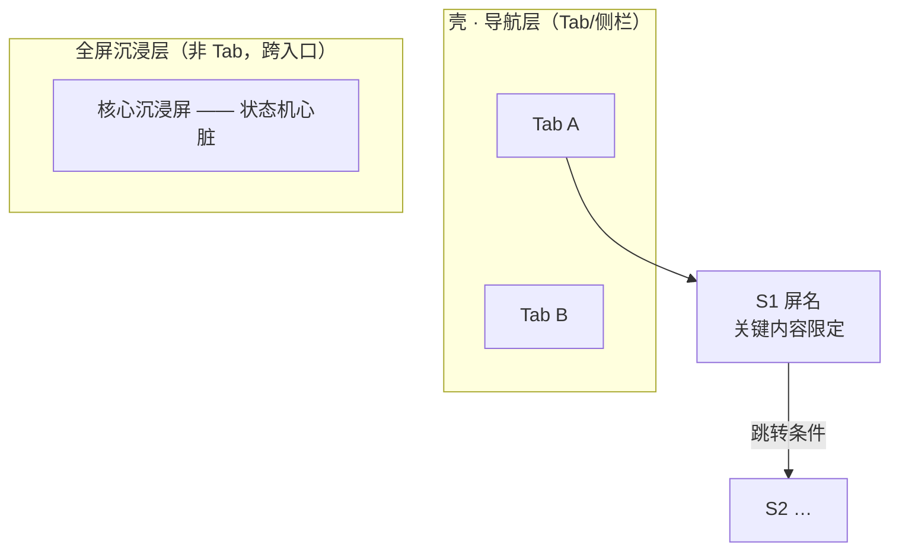

# 阶段 3：屏幕清单 + 信息架构（任务卡）

## 目的

从**流程停留点**推导屏幕（不是从功能清单分解屏幕），分级挂载，并盘点每屏内容。

## 输入

`02-流程草图.md`（已确认）。

## 产出与模板（写入 `03-屏幕与IA.md`）

1. **IA 图**（Mermaid）：

   分层：导航壳 / Tab 落点页 / 二级页 / 全屏沉浸层 / 浮层弹层。**沉浸型核心屏（练习/编辑/播放类）不是 Tab，是跨入口的全屏层**。

2. **屏幕盘点表**（card-sorting 粒度，不做完整规格）：

| ID | 屏幕 | 层级 | 信息内容 | 操作（**主**加粗） | 服务流程 | 模式倾向* |
|---|---|---|---|---|---|---|

   \* 模式倾向仅作阶段 4 选型输入。领域特有的版式（如提词器式/代码编辑器式）超出常规枚举时**如实标注"超出模式库，阶段 4 定义"**——模式库服务于设计，不是设计服从模式库。

3. **闭环检查表**：每条流程 → 覆盖屏幕列表 → ✅；孤儿屏检查（每屏被 ≥1 流程触达）。
4. **关键屏提名**（2–3 个，阶段 4 只做这些）：提名标准=状态机最复杂屏 / 第一印象屏 / 风险最高交互屏。
5. **新问题 P3-x**（带倾向）。

## 完成标志

闭环检查全 ✅；关键屏名单被认可；屏幕数 ≤12（超限拆工作区）。

## 人工决策点

认 IA 分层与 Tab 划分；认屏幕清单；认关键屏提名；拍 P3-x。

## 工具化要点（网页工具映射）

- AI 任务：从 Mermaid 流程解析停留点 → 生成 IA + 盘点表草稿。
- 界面：屏幕清单=可编辑表格（增删行=改 IA）；IA 树形导航渲染。
- **落库时机：此阶段初始化 pages 表**（ID/名称/层级/状态清单），后续阶段的产物都挂 page-id。
- gate：闭环检查脚本化（解析 02 的 mermaid 停留点 vs 03 的屏 id 集合，双向差集为空）。
